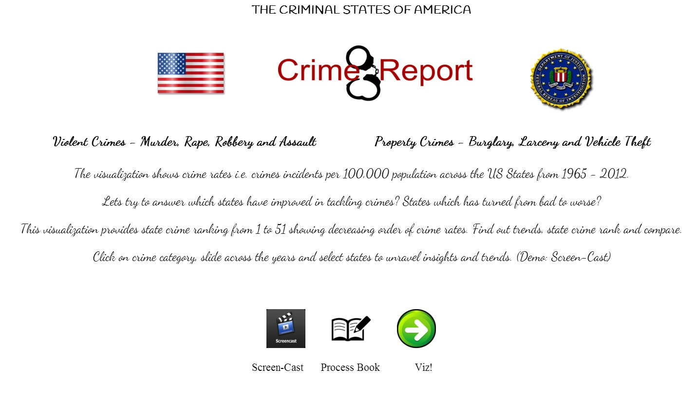

# DataVisFinal_Testing
TITLE

Project Team:
Amogh Raghunath
Harsh Vardhan
Arun Vadivel

Links:
<Visualization>
<Screencast>

Overview:
<Browse through internet> This is a visualization for Crime Rates in USA from 1966-2012.  The visualization has two layouts.  The first layout shows the user about the trends of different states in USA for each category of crimes with an interactive map and the ranks of the states for each of those category from the years 1966-2012.  The second layout is for comparing different states based on the total violent crime on a multiple line chart for the years 1965-2012. There is a navigation link between the two layout and an introduction page for the convenience of the user to shift between visualizations.

Introduction Page:
	The introduction page contains a short description about what this visualization is about and with links to screencast, process book and the visualization. This page is developed using HTML and CSS, and it has few images and the some content to introduce the user to the story of the visualization. This is the page from where the visualization starts from.
	
	Introduction.html contains the main code for this page with a supporting introStyle.css within the ‘css’ folder. The images for this page is in ‘img’ folder. The three links from this page is basically based on an image click with hyperlink function. The first link navigates to the screen-cast link, which is a YouTube link. The user will have a two minutes walkthrough on the visualizations. The second link navigates to the process book, which is a PDF file. The file ‘process_book.pdf’ is contained in the ‘process_book’ folder. The third link takes the user to the visualization, starting with layout 1.

Data:
The data is present in ‘crime.csv’ file and it contains all the required data for the visualization.

Layout 1:
	This visualization has an interactive map with to visualize the trends of different states from 1966-2012 with the help of a year slider and a rank table for different categories of crime.
	Layout1.html – HTML file for the visualization of Layout 1 with a call to main_crime.js and the link to D3.js library.
	In ‘js’ folder:
	main_crime.js – This file has the initial call from where the major interactions of the visualizations take place. It also controls the call to the category rank table and the interactive map.
	slider.js – Contains the code for slider function for the years form 1966-2012. This triggers a function call to change the rank table and the color of the interactive map by calling uStates.js
	uStates.js – Contains the us.json content for the path of the map. Part of the code where rank table is calculated.
	In ‘css’ folder:
	Layout1.css – Contains the CSS styling functions for the Layout.html file.
	In ‘img’ folder:
	Contains the images for different categories presented in layout1.html
<picture>

The user can view the crime trends of all the states from 1966-2012 using the interactive map and the slider for changing the years. This can be changed for different categories. Also there is a rank table for the user to display the rank of each state (based on a click on the map) for different categories, which changes dynamically.

Layout 2:
	Layout 2 is the visualization to compare different states in USA on basis of Violent Crime Rates for the years 1966-2012 using multiple line chart.
	Layout2.html – HTML file for the visualization to compare violent crime rates for different states from 1966-2012. Calls jQuery for ‘jquery-hover-dropdown-box’ for interactive checkbox.
	In ‘js’ folder:
	Line.js –JavaScript file for data processing and initializing the layout appearance.
	Draw_line.js – The JavaScript file that is triggered based on every user interaction. Contains the code for drawing/deleting the line on the line chart.
	jquery-hover-dropdown-box.js – JavaScript file for interactive dropdown checkbox to select/deselect multiple states.
	In ‘css’ folder:
	Layout2.css – CSS styling for layout2.html
	jquery-hover-dropdown-box.css – CSS for ‘jquery-hover-dropdown-box’.
	jquery-hover-dropdown-box.less – Support file for ‘jquery-hover-dropdown-box.css’.

<image>

This visualization is aimed at comparing different states in USA from 1966-2012 using multiple line chart. When the user hovers over the ‘Compare’ button, the list of states are displayed. Based on the choice of the user, different states can be selected where each state is associated with a unique color, which is reflected in the line chart as the color of the corresponding line. There is also an interactive tip tool to compare different states’ values displayed on the line chart.

